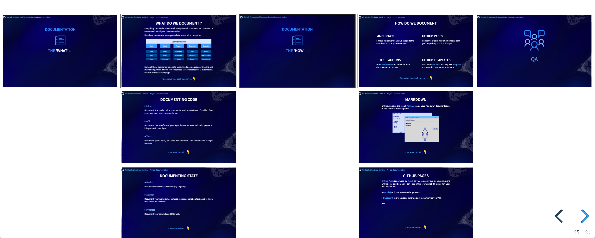
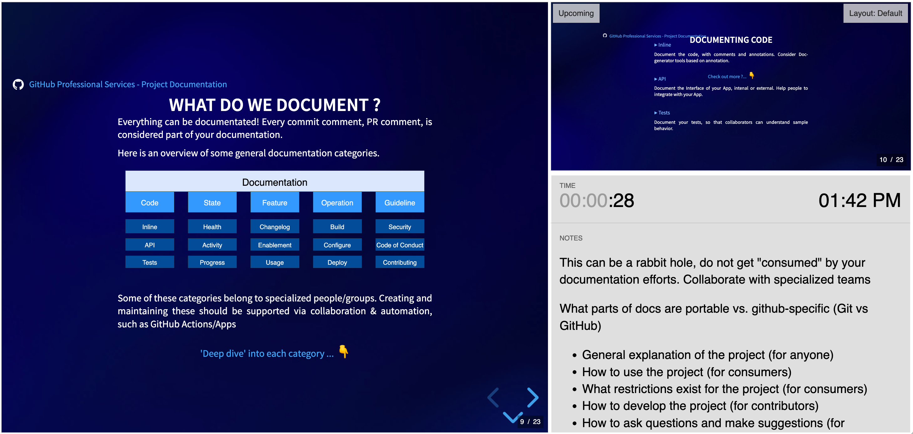

# Why, What and How do we document our code

This Repository is a demo on the usage of [RevealJS](https://revealjs.com) for GitHub presentations.

>NOTE: The **focus here is NOT the presentation content** but rather the use of RevealJS in GitHub-Pages.

## To see the "live" demo open the [GitHub-Pages](https://jefeish.github.io/why-what-how-to-document_presentation-demo/)

## Presentation - Preview

---

## Presentation - Slides Overview

### `Press ESC` to get an overview of all the slides

#### Sample

---

## Presentation - Speaker Notes

### `Press S` while running the demo to see the `Speaker-Notes`

#### Sample

